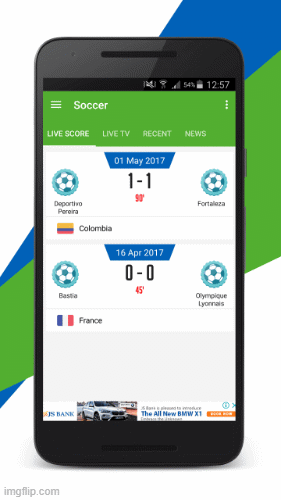

# Desafio Bootcamp Global Santander : FullStack Mobile Developer

### Parte I

### Overview
Live Soccer Score & News – live TV is an application that help users to watch live matches as well as this application contains all news update about soccer famale. User can also watch recently completed matches. Users can also view the full detail of each match, Lineups, Statistics and Commentary, live matches to their friends. More over Attractive application has a fabulous and user friendly interface..



## Tecnologia
Linguagens:
Kotlin
Xml

## Arquitetura usada:
MVVM

## Libraries:
* Retrofit 2.9.0 (https://square.github.io/retrofit/)
* Gson 2.9.6 (https://github.com/google/gson)
* Room 2.4.2 (https://developer.android.com/training/data-storage/room)
* Glide 4.13.0 (https://github.com/bumptech/glide)
* Coroutine 1.6.1 (https://developer.android.com/kotlin/coroutines)
* Paging 3.1.1 (https://developer.android.com/topic/libraries/architecture/paging/v3-overview)
* Hilt 2.40.1 (https://developer.android.com/training/dependency-injection/hilt-android)
* ViewPager 1.0.0 (https://developer.android.com/jetpack/androidx/releases/viewpager2)
* ViewModel, LiveData, Viewbinding 2.4.1 (https://developer.android.com/jetpack/androidx/releases/lifecycle)


### Steps Execution

```
add Sportmonks.com API
```

 * Files Included	

 ```
.apk, .java, .xml
```

 * Software Version	 

 ```
 Android 8.1, Android 8.0, Android 7.2.x, Android 7.1.x, Android 6.0, Android 5.1.x, Android 5.0, Android 4.4.x, Android 4.3.x, Android 4.2.x, Android 4.1.x, Android 4.0.4, Android 4.0.3, Android 4.0
```


## Tags	

```
1.admob, 
2.football, 
3.ip tv, 
4.league, 
5.live, 
6.live scores, 
7.live tv, 
8.m3u8, 
9.match, 
10.news, 
11.scores, 
12.soccer, 
13.sports, 
14.statistics
```

### © All Rights Reserved 
** DeveloperBY Cleiton Correa **